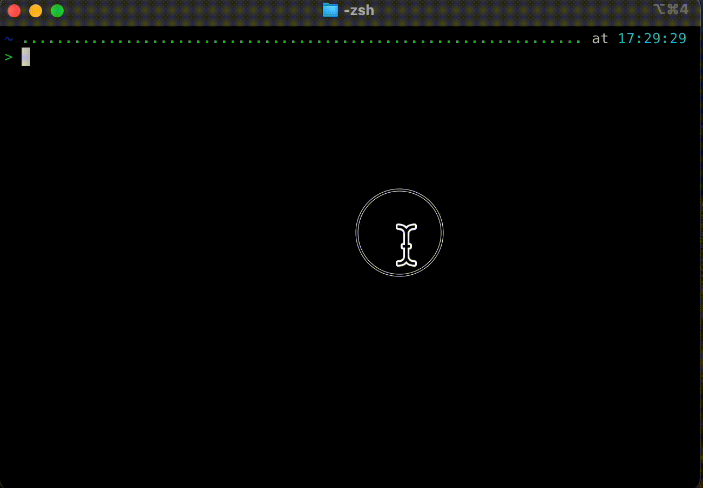
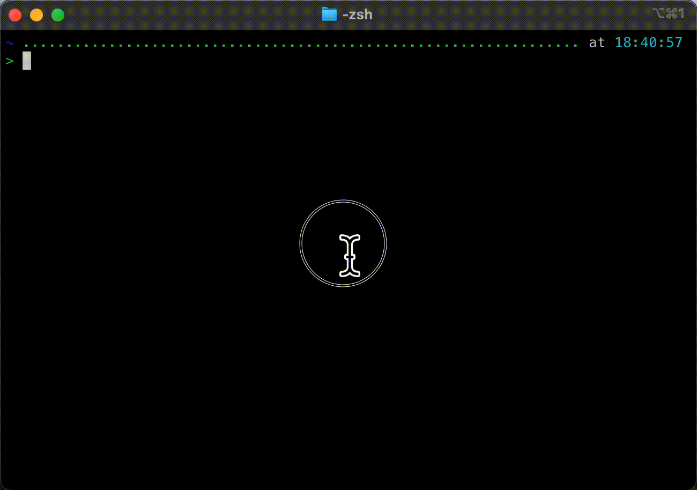

# UTM_on_mac

## 1. Install Brew 
You can install Homebrew easily on mac:
* open a terminal
* Type or copy/paste this code and then press "return": 
```Shell
/bin/bash -c "$(curl -fsSL https://raw.githubusercontent.com/Homebrew/install/HEAD/install.sh)"
```


 

This script will install brew and Xcode. You'll need to Agree to install xcode.

## 2. Install UTM

To install UTM using brew:
```Shell
brew install --cask utm
```


## 3. Install Crystal Fetch (Windows) [Move to step 7 for MacOS VMs]

To install Crystal Fetch using brew:
```Shell
brew install --cask crystalfetch
```



## 4. Download Windows11 and Setup Your Win11 VM


## 5. Setup Win11


## 6. Finishing Up Windows Install


## 7. Install Mist (MacOS)

```Shell
brew install --cask mist
```



## 8. Download MacOs Firmware Image


## 9. Setup Your MacOS VM


## 10. Setup Your MacOS 


## References:

[Homebrew](https://brew.sh/) - is a package manager for MacOS, used to easily install apps and programs from the web.

[UTM](https://mac.getutm.app/) - UTM is a GUI wrapper for KVM. UTM allows a user to easily create and edit virtual machines on MacOS.

[Crystal Fetch](https://github.com/TuringSoftware/CrystalFetch) - automation for downloading Windows 10/11

[Mist](https://github.com/ninxsoft/Mist) - automation for downloading MacOS firmware and installer images