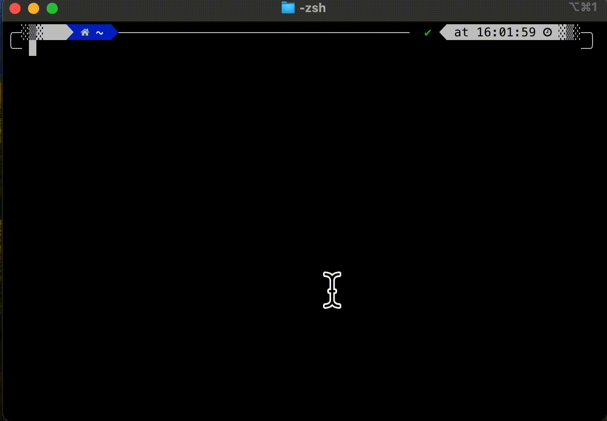

# UTM_on_mac

## Install Brew 
You can install Homebrew easily on mac:
* open a terminal
* Type or copy/paste this code and then press "return": 
```Shell
/bin/bash -c "$(curl -fsSL https://raw.githubusercontent.com/Homebrew/install/HEAD/install.sh)"
```


 

This script will install brew and Xcode. You'll need to Agree to install xcode.

## Install UTM

To install UTM using brew:
```Shell
brew install --cask utm
```




## References:

[Homebrew](https://brew.sh/) - is a package manager for MacOS, used to easily install apps and programs from the web.


[UTM](https://mac.getutm.app/) - UTM is a GUI wrapper for KVM. UTM allows a user to easily create and edit virtual machines on MacOS.
